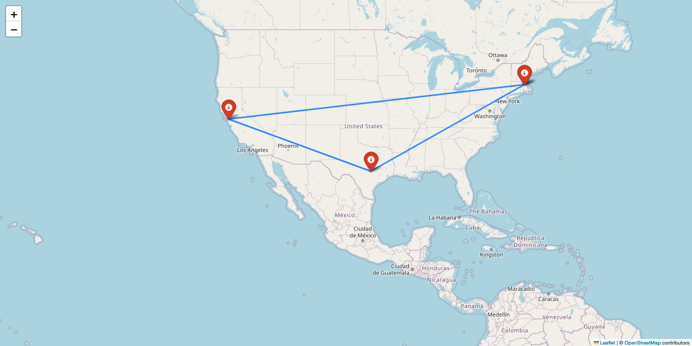

# travelling-salesman-cli

This is a command-line tool that calculates the shortest path between 2-10 cities in the USA.
    This tool can also create an image that shows the calculated path.

      A flag can be added to avoid saving the path into an image. This image is saved by default or when the flag is True.

    Examples:
    ./calculate_route.py tsp_path citiescli "Boston" "San Francisco" "Austin"
    ./calculate_route.py tsp_path citiescli "Boston" "San Francisco" "Austin" --image False
    ./calculate_route.py tsp_path citiescli "Boston" "San Francisco" "Austin" --image True

